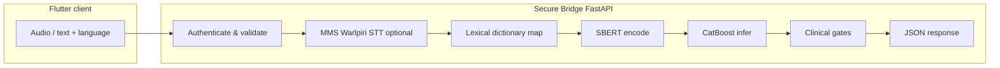

# SACA FastAPI Backend Architecture  
### *Presentation-ready technical overview — Swin Smart Adaptive Clinical Assistant (SACA)*

---

## 1. Executive Summary

The **SACA backend** is a **fail-safe, bilingual clinical triage API** built on **FastAPI**. It exposes a thin, auditable boundary—the **Secure Bridge**—between mobile capture (Flutter) and server-side reasoning. The pipeline is engineered for **clinical conservatism**: probabilistic inference (including **CatBoost** for severity-focused decisions in the consolidated design) operates **under** explicit **deterministic safety layers**—so that ambiguous model output or unmistakable crisis language cannot silently degrade to inappropriate reassurance. NLP uses **sentence-BERT** (`sentence-transformers/all-MiniLM-L6-v2`) for semantic encoding of clinician-verified English text. For **Warlpiri**, the planned path couples **Meta Massively Multilingual Speech (MMS)** recognition in the **`wbp` (Warlpiri)** modality with a **lightweight lexical normalization bridge** ([`translate_clinical_transcript`](api/bridge/clinical_text.py#L17-L29) in this repo; optionally split into a `warlpiri_dict` module) mapping clinical tokens into the English symptom vocabulary consumed by SBERT. Together, FastAPI orchestration, STT/NLP, pooled **CatBoost** artifacts, and **human-in-the-loop** transcripts foreground **patient safety**, **auditability**, and **retraining-grade data lineage**.

---

## 2. High-Level Data Flow — The “Secure Bridge”

Below is the **canonical end-to-end path** for a single triage prediction when the Flutter client submits structured text (human-in-the-loop mode). Equivalent audio-first flows converge after speech-to-text.

**Step-by-step journey**

1. **Flutter — audio or verified text request**  
   The client sends either (a) a multipart voice payload to an analyze-voice style route or (b) a JSON **`/triage/predict`** payload with paired transcripts plus language tags.  
   *Code:* [`TriagePredictRequest`](api/bridge/models.py#L20-L24) · [`triage_predict_multipart_compat`](api/bridge/router.py#L185-L220) · [`triage_predict`](api/bridge/router.py#L125-L170)

2. **FastAPI — endpoint admission**  
   The router validates input shape, optionally enforces bearer authentication, timestamps the request, and routes to triage orchestration.  
   *Code:* [`api/main.py`](api/main.py) · [`api/bridge/router.py`](api/bridge/router.py) · [`verify_bearer_token`](api/bridge/security.py#L8-L15)

3. **Warlpiri-to-English clinical normalization** *(when `language` indicates Warlpiri / low-resource pathway)*  
   **Meta MMS (`wbp`)** produces orthographic tokens in settings where full ASR throughput is desirable; downstream, a **fast dictionary-mapping layer** substitutes or glosses clinically salient constituents into standardized **English symptom phrases** aligned with SBERT’s training manifold—**without** retraining multilingual sentence encoders end-to-end. *(Implemented as `translate_clinical_transcript` in `clinical_text.py`; a larger `warlpiri_dict` module is an optional extract.)*  
   *Code:* [`translate_clinical_transcript`](api/bridge/clinical_text.py#L17-L29)

4. **SBERT vectorization**  
   Normalized verified text is encoded to a dense embedding used both for calibrated risk bias in hybrid scoring and—as the stack matures—for **alignment with symptom inventory** and pooling features prior to boosted-tree inference.  
   *Code:* [`NLPService.encode`](api/bridge/nlp_service.py#L35-L45)

5. **Boosted-tree / tabular severity inference** *(CatBoost in the consolidated design; joblib severity/disease heads in `archive/Model_ExtraNGvboost`)*  
   The **live bridge** uses [`ExtraNGPredictor`](api/bridge/ml_predictor.py) when all required `.pkl` files are present under [`CFG.extrang_model_dir`](api/bridge/config.py#L36-L43); otherwise it falls back to rules + embedding bias in [`TriageService._heuristic_decide`](api/bridge/triage_service.py#L97-L132). Phrase canonicals come from [`symptom_lexicon`](api/bridge/symptom_lexicon.py). Legacy entrypoint: [`archive/Model_ExtraNGvboost/predictor.py`](archive/Model_ExtraNGvboost/predictor.py).  
   *Code:* [`TriageService.decide`](api/bridge/triage_service.py#L63-L95) · [`symptom_columns` load](api/bridge/triage_service.py#L53-L61) · [`archive/Model_ExtraNGvboost/` (artifacts)](archive/Model_ExtraNGvboost/)

6. **Clinical escalation gates**  
   Outputs of the probabilistic tier are intersected with **hard rules**: low calibrated confidence thresholds and **explicit emergency lexicon**. Any trigger **forces Severe disposition** irrespective of naive model softness.  
   *Code:* [`triage_predict` escalation block](api/bridge/router.py#L143-L149) · [`contains_emergency_keyword` / `EMERGENCY_KEYWORDS`](api/bridge/clinical_text.py#L9-L43) · [`SEVERE_KEYWORDS` / rules in service](api/bridge/triage_service.py#L46-L90) · threshold: [`low_confidence_triage_threshold`](api/bridge/config.py#L36-L38)

7. **JSON response**  
   Structured triage outcome, clinician-facing wording, **`top_3_symptoms`** (interpretive drivers toward transparency), escalation flags, and optional verification metadata return to Flutter for display and onward logging.  
   *Code:* [`TriagePredictResponse`](api/bridge/models.py#L26-L32) · [`return TriagePredictResponse`](api/bridge/router.py#L160-L167)

### Clickable code map *(this repository)*

In editors and on Git hosts, follow the links below to open the implementation for each stage. *(The Flutter app is not in this workspace; links for step 1 point to the JSON/multipart contract the mobile client must satisfy.)*

| Step | What to open |
| ---- | ------------- |
| **01 — Flutter → API** | Request body: [`api/bridge/models.py` — `TriagePredictRequest`](api/bridge/models.py#L20-L24) · Multipart + audio path: [`triage_predict_multipart_compat`](api/bridge/router.py#L185-L220) · JSON predict: [`triage_predict`](api/bridge/router.py#L125-L170) |
| **02 — FastAPI admission** | App + CORS: [`api/main.py`](api/main.py) · Router wiring: [`api/bridge/router.py`](api/bridge/router.py) (imports through health) · Bearer check used on protected routes: [`api/bridge/security.py` — `verify_bearer_token`](api/bridge/security.py#L8-L15) |
| **03 — Warlpiri normalization (`wbp`)** | Dictionary-style token gloss into English-like clinical text: [`translate_clinical_transcript`](api/bridge/clinical_text.py#L17-L29) *(no separate `warlpiri_dict.py` in this repo; extend this function or extract a module if you split it)* |
| **04 — SBERT vectorization** | Encoder + fallback: [`api/bridge/nlp_service.py` — `NLPService.encode`](api/bridge/nlp_service.py#L15-L45) |
| **05 — Severity / tabular inference** | [`symptom_lexicon.py`](api/bridge/symptom_lexicon.py) · ML: [`ExtraNGPredictor`](api/bridge/ml_predictor.py) · orchestration: [`TriageService.decide`](api/bridge/triage_service.py#L63-L95) · heuristic fallback: [`_heuristic_decide`](api/bridge/triage_service.py#L97-L132) · config: [`extrang_model_dir` / `symptom_columns_path`](api/bridge/config.py#L34-L43) · archived reference script: [`archive/Model_ExtraNGvboost/predictor.py`](archive/Model_ExtraNGvboost/predictor.py) |
| **06 — Clinical escalation gates** | Low-confidence + emergency lexicon overrides in API: [`triage_predict` body](api/bridge/router.py#L143-L149) · Emergency lexicon: [`clinical_text.py`](api/bridge/clinical_text.py#L9-L43) · Keyword sets in service: [`SEVERE_KEYWORDS` / `MODERATE_KEYWORDS`](api/bridge/triage_service.py#L46-L47) · [`low_confidence_triage_threshold`](api/bridge/config.py#L36-L38) |
| **07 — JSON response** | Response schema: [`api/bridge/models.py` — `TriagePredictResponse`](api/bridge/models.py#L26-L32) · Serialization site: [`return TriagePredictResponse(...)` in `triage_predict`](api/bridge/router.py#L160-L167) |

**Audio-first variant (reference):** upload handling and STT before analysis: [`_transcribe_upload`](api/bridge/router.py#L44-L94) · [`triage_analyze_voice`](api/bridge/router.py#L173-L182) · [`api/bridge/stt_service.py`](api/bridge/stt_service.py) · Post-STT NLP path: [`_analyze_transcript`](api/bridge/router.py#L97-L112).

**Visual summary (conceptual)**



---

## 3. The API Contract — Human-in-the-Loop Integrity

### 3.1 `/triage/predict` request schema *(core fields)*

| Field | Role |
| ----- | ----- |
| **`raw_transcript`** | Canonical record of **what automated speech perception produced** prior to editorial correction—the best-effort acoustic transcript. |
| **`verified_transcript`** | Canonical record of **what the human verifier attests**—post-editing wording that will drive clinical reasoning and escalation. |
| **`language`** | Language tag informing normalization (English default; Warlpiri pathway when `wbp`). |

Architecturally these fields embody **dual provenance**:

- **`raw_transcript`** captures **instrumented ASR fidelity** — useful for **audio–text alignment QA**, MMS language-pack evaluation, dialect robustness telemetry, and **error analysis**.
- **`verified_transcript`** captures **clinician epistemic authority** — the operative string for NLP and triage, reflecting correction of homophones, domain terminology fixes, omission repair, or entirely missing ASR hypotheses.

### 3.2 Why separation matters

- **Clinical data integrity.** Decisions attributable to erroneous ASR hallucinations violate traceability norms; bifurcation makes **post hoc adjudication** defensible (“model saw *verified*, ASR emitted *raw*”).
- **Retraining and curriculum design.** Labels may be regenerated against **edited** transcripts while supervised contrastive datasets pair **noise (raw)** with **truth (verified)** — a classic **speech–NLP joint improvement loop**.
- **Regulatory ergonomics.** Clear provenance aligns with expectations for **explainable modification** chains in assisted decision support.

Implementation detail: **`escalation_triggered`** in the predictive response persists whether safety gates mutated the probabilistic disposition—supporting retrospective compliance review.

---

## 4. The Bilingual NLP Pipeline — Core Innovation

### 4.1 Low-resource linguistic challenge

**Warlpiri** exemplifies constrained digital resources compared to metropolitan English corpora powering general SBERT checkpoints. Fully retraining multilingual encoders—or fine-tuning at clinical depth—incurs scarce parallel clinical text.

### 4.2 Architecture stance (without exhaustive retraining)

| Layer | Function |
| ----- | --------- |
| **Meta MMS (`wbp`)** | Leverages multilingual speech front-ends pretrained at scale; supplies **robust graphemic hypotheses** tailored to Indigenous Australian speech where configured. |
| **`warlpiri_dict.py` (dictionary bridge)** | O(LEX) lexical projection from recognized tokens / stable clinical glosses toward **controlled English symptom lexicon**. |
| **SBERT encoder** (`all-MiniLM-L6-v2`) | Stable, efficient Transformer sentence embedding aligning downstream scoring with biomedical phrasing latent structure after normalization—not raw Warlpiri free text. |

**Design principle.** **Composable specialization**: speech expertise (MMS) + lexical governance (dictionary bridge) reuse a **frozen or lightly refreshed** semantic encoder tuned for clinician English—not an end‑to‑end Warlpiri deep language model scarcity trap.

---

## 5. The Triage Engine & Explainability

### 5.1 CatBoost in the consolidated stack

Independent **evaluation** prioritized **CatBoost** on weighted criteria blending **severe recall fidelity**, NLP noise degradation resistance, inference latency envelopes, and resource ceilings—establishing CatBoost severity heads as recommended production core.

**Operational characteristics prized for triage**:

- Performs strongly on heterogeneous tabular encodings mingling symptoms, embedding-derived aggregates, categorical flags.
- Favorable inference latency envelopes when artifacts are preload-resident versus cold-start ONNX/scikit substitutes in pilot comparisons.

### 5.2 Top three symptom drivers (anti–black-box design)

Returning **`top_3_symptoms`** (and, in fuller explainability payloads, analogous **impact / attribution magnitudes**) **surfaces causal contributors** aligning user mental models:

- Helps remote health workers reconcile model urgency with conversational cues they observed.
- In future iterations, aligns with **prediction difference / SHAP-lite** aggregates exportable alongside leaves for CatBoost for regulator-facing dossiers—even if heuristic extraction precedes exhaustive attributions operationally during pilot.

**Integrity stance.** Transparency is tactical: partial drivers **reduce unwarranted trust calibration drift** (“the model surfaced chest pain—not generic ‘malaise’—as dominant driver”).

> **Teaching note.** Current bridge reference code may synthesize explanatory symptom triples lexically before pooled CatBoost attributions unify; phased integration aligns returned drivers with pooled feature-importance ranking from trained heads.

---

## 6. Clinical Escalation Gates — The Deterministic Safety Net

This subsystem is deliberately **orthogonal** to the probability outputs of boosted trees—it encodes institutional **duty of care** as **non-learned policy**.

### 6.1 Rationale overlaying ML

Medical ML errs **asymmetrically**: silent under-triage dominates expected harm magnitude versus benign over‑triage inconvenience. Gates implement **Worst plausible case conservatism** without discarding probabilistic stratification upstream.

### 6.2 Example triggers encoded in Secure Bridge reasoning

| Trigger class | Approximate predicate | Intended clinical effect |
| ------------- | -------------------- | ------------------------ |
| **Low confidence escalation** | If baseline predicted **Moderate** or **Mild** yet **confidence < 0.60** | **Elevate disposition to Severe** — escalate until human bandwidth reassesses. |
| **Emergency lexical override** | Presence of enumerated **high acuity snippets** *(e.g. “chest pain”, dyspnea phrasing akin to inability to breathe, “unconscious”)* | Immediate **forced Severe** flag (`escalation_triggered`). |

### 6.3 Malpractice guardrail narrative

 Overrides are **explicit, logged, deterministic** policy—not learned weights—preventing brittle models from **discounting verbally explicit emergencies** latent in lexical surface form. This addresses **dual-use failure modes**:

- **Confidence overconfidence.** Well-calibrated probabilistic softness must not domesticate verbally explicit crisis narration.
- **Embedding blind spots.** SBERT orthogonal gates ensure certain token-level hazards remain **symbolically unmistakable**.

**Pedagogical closure.** Probabilistic models propose; **gates dispose** whenever patient safety dominates expected value of silent acceptance.

---

## 7. Performance & Latency Optimizations

| Technique | Benefit |
| --------- | --------- |
| **Module-level singleton service objects** *(STT, SBERT NLP, pooled triage / future CatBoost calcer holders)* instantiated at import/start | Eliminates catastrophic per-request Torch / tree **cold spin-up** jitter. |
| **Pre-loaded `.cbm`, `.onnx`, or `.pkl` artifacts** pinned on boot | Converts multi-second deserialization spikes into **amortized O(serve)** readiness. |
| **CPU-friendly SBERT sizing** *(MiniLM L6 variant)* | Favorable latency–quality trade envelope for WAN + edge clinic constraints. |

**Throughput discipline.** Request path stays **mostly CPU-linear** after warmup (subject to MMS activation policy). Async FastAPI shields STT-heavy routes from needless blocking starvation when configured thoughtfully.

---

## 8. Key Takeaways *(slide closers)*

- **Architecture = Safety × Modularity.** Each stage is replacable independently (speech front-end swap, boosted-tree refresh, rule-set governance revision).
- **Human authority is typed**, not incidental—dual transcripts preserve supervisory provenance over machine perception.
- **Deterministic gates outperform clever loss engineering** where tail clinical risk dominates expectation.
- **Explainability primitives** (**Top‑3 symptom drivers**) are first-class—not post-hoc marketing—to align human–AI teamwork.

---

## Appendix A — Fidelity Snapshot vs Roadmap *(for Q&A honesty)*

| Capability | Planned / consolidated architecture narrative (Sections 2–6) | Current reference implementation tendencies *(verify before demo)* |
| ---------- | ------------------------------------------------------------ | -------------------------------------------------------------------- |
| **Warlpiri** | MMS `wbp` ASR plus `warlpiri_dict.py` modular dictionary | Lightweight inline lexical substitution when `language = "wbp"` may precede MMS swap-in; extract dictionary to **`warlpiri_dict.py`** for clarity. |
| **Probabilistic triage kernel** | CatBoost pooled heads + schema artifacts (`symptom_columns.pkl`, etc.) | Bridge may synthesize deterministic rule + semantic-bias strata **prior** full CatBoost hotload—align with backlog checklist in internal evaluation dossier before claiming parity. |
| **Explainability vectors** | Top symptom drivers anchored in model attributions where available | Responses may presently rank symptoms via controlled phrase inventory—upgrade path to surfaced **CatBoost importances**. |

Maintain this appendix verbally when professors probe **literature fidelity** versus **engineering staging**.

---

## Appendix B — Core JSON schema excerpts *(`/triage/predict` conversation)*

**Request *(illustrative abridgement)*.**

```json
{
  "raw_transcript": "string — ASR / MMS best effort",
  "verified_transcript": "string — human-corrected clinical wording",
  "language": "en | wbp"
}
```

**Response *(illustrative abridgement)*.**

```json
{
  "triage_level": "Severe | Moderate | Mild",
  "top_condition": "string",
  "confidence": 0.0,
  "top_3_symptoms": ["...", "...", "..."],
  "recommendation": "string",
  "escalation_triggered": true
}
```

---

*Document classification: pedagogical architectural brief — aligns internal model QA recommendations (`CatBoost` severity leadership, dual transcript provenance backlog) with end-state Secure Bridge exposition; verify live deployment deltas before asserting exclusive CatBoost kernels.*
