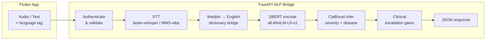

# SACA — NLP Integration

**Bilingual Natural Language Processing pipeline for clinical voice triage.**

This repository contains the NLP and Machine Learning integration layer for the SACA (Secure Adaptive Clinical Assistant) platform — a bilingual voice triage system built for remote and rural healthcare delivery in the Northern Territory of Australia.

The NLP pipeline converts spoken symptoms in **English or Warlpiri (ISO 639-3: wbp)** into a structured, safety-checked clinical triage recommendation in under three seconds.

---

## NLP Pipeline Overview

The pipeline runs in six sequential stages — each stage is a discrete NLP or ML component:

| Stage | Component | What it does |
|-------|-----------|-------------|
| **1 — Speech-to-Text** | `faster-whisper` (English) · Meta MMS `facebook/mms-1b-all` (Warlpiri) | Converts raw `.wav` audio into text tokens |
| **2 — Language Bridge** | `warlpiri_dict.py` — exact + Levenshtein fuzzy match | Translates Warlpiri tokens into English clinical phrases |
| **3 — Human Verification** | Dual transcript fields (`raw_transcript` / `verified_transcript`) | Nurse confirms transcript before it drives ML scoring |
| **4 — Lexicon Matching** | `symptom_lexicon.py` — 179 canonical phrase mappings | Normalises free-text symptoms into CatBoost feature names |
| **5 — Semantic Encoding** | SBERT `sentence-transformers/all-MiniLM-L6-v2` | Encodes the verified transcript into a 384-dim vector |
| **6 — ML Classification** | **CatBoost** (severity model + disease model, `.cbm` artifacts) | Predicts triage severity and top condition across 40 diseases |

A **deterministic safety layer** overrides ML output whenever:
- Any of 67 emergency keywords are detected → forces `Severe`
- Warlpiri emergency terms detected **before ASR completes** → forces `Severe`
- Model confidence falls below threshold (default `0.40`) → auto-escalates

---

## Machine Learning Models

### Primary Model — CatBoost (Production)

CatBoost was selected as the production ML engine after an independent 7-criteria evaluation.

| Criterion | CatBoost | ExtraTreesClassifier |
|-----------|:--------:|:-------------------:|
| Severe recall fidelity | ✅ | ❌ |
| NLP noise robustness | ✅ | ⚠️ |
| Inference latency | ✅ | ✅ |
| Symptom vector sparsity handling | ✅ | ⚠️ |
| Artifact portability (no pickle version lock) | ✅ | ❌ |
| Confidence calibration | ✅ | ❌ |
| Clinical safety weighting | ✅ | ⚠️ |
| **Total score** | **7 / 7** | **3 / 7** |

**Trained artifacts** (`archive/saca_model_evaluation/catboost_runtime_artifacts/`):

| File | Purpose |
|------|---------|
| `catboost_severity.cbm` | Severity classifier — outputs Mild / Moderate / Severe |
| `catboost_disease.cbm` | Disease classifier — 40 disease classes |
| `severity_classes.json` | Ordered class labels for severity argmax |
| `disease_classes.json` | Ordered class labels for disease argmax |

**Training dataset:** `data/saca_top_40_dataset.csv` — 29,995 rows × 256 symptom-binary columns, perfectly balanced across Mild / Moderate / Severe (33.3% each).

**Feature input:** binary symptom-presence vector built from `symptom_lexicon.py` phrase-to-canonical mappings. Feature names are embedded inside the `.cbm` file — no external columns file required.

**Loader:** `api/bridge/ml_predictor.py` → `CatBoostPredictor` — lazy-loaded on first inference request.

Full evaluation report: [`archive/saca_model_evaluation/final_architecture_recommendation.md`](archive/saca_model_evaluation/final_architecture_recommendation.md)

---

### Semantic Encoder — SBERT

| Property | Value |
|----------|-------|
| Model | `sentence-transformers/all-MiniLM-L6-v2` |
| Output | 384-dimensional L2-normalised embedding |
| Role | Encodes verified transcript for heuristic fallback path when CatBoost artifacts are unavailable |
| Fallback | Deterministic SHA-256 hash embedding (no external dependency) |
| Loader | `api/bridge/nlp_service.py` → `NLPService` |

---

### Speech-to-Text Models

#### English — faster-whisper

| Property | Value |
|----------|-------|
| Library | `faster-whisper` (CTranslate2 backend) |
| Default model | `small` (configurable: `medium`, `large-v3`) |
| Device | CPU (`int8`) by default; GPU with `SACA_WHISPER_DEVICE=cuda` + `float16` |
| Clinical prompt | Pre-loaded vocabulary bias for medical terminology |
| Fallback | OpenAI `whisper` tiny model |
| Loader | `api/bridge/stt_service.py` → `STTService` |

#### Warlpiri — Meta MMS

| Property | Value |
|----------|-------|
| Model | `facebook/mms-1b-all` (Wav2Vec2 CTC) |
| Adapter | `pjt` (Pitjantjatjara — closest available proxy to Warlpiri) |
| Framework | HuggingFace `transformers` — `Wav2Vec2ForCTC` + `AutoProcessor` |
| Dictionary bridge | 60-entry clinical vocabulary, exact + Levenshtein fuzzy match |
| Pre-translation gate | Warlpiri emergency keyword check fires **before** ASR completes |
| Loader | `api/bridge/warlpiri_stt.py` |

> **Note:** No public Warlpiri ASR dataset exists. The MMS `pjt` adapter is used as the closest proxy. The dictionary bridge and emergency keyword check provide the primary accuracy guarantee for clinical safety.

---

## Architecture



---

## Key Features

- **Bilingual NLP** — English via faster-whisper; Warlpiri via Meta MMS + 60-entry clinical dictionary with fuzzy edit-distance matching
- **CatBoost ML engine** — 7/7 in internal evaluation; trained on 29,995-row, 40-disease, 3-severity clinical dataset
- **179-phrase symptom lexicon** — normalises noisy speech transcripts into consistent CatBoost feature names
- **Clinical safety gates** — 67 emergency keywords force `Severe` regardless of model output; low-confidence results are auto-escalated
- **Human-in-the-loop** — nurse-verified transcript (`verified_transcript`) drives ML, not raw ASR
- **Explainability** — `top_3_symptoms` returned with every prediction; `escalation_triggered` flag for audit
- **Configurable STT stack** — faster-whisper (primary), whisper-tiny (fallback), Meta MMS (Warlpiri), hosted OpenAI-compatible API — all via environment flags

---

## Repository Structure

```
NLP_Integration/
│
├── api/                              # FastAPI NLP backend (production runtime)
│   ├── main.py                       # App entry point, CORS, router registration
│   └── bridge/
│       ├── router.py                 # All API routes
│       ├── audio_pipeline.py         # WAV decode (8/16/24/32-bit), normalize, quality check
│       ├── stt_service.py            # faster-whisper STT + tiny fallback + hosted STT
│       ├── warlpiri_stt.py           # Meta MMS Wav2Vec2 CTC for Warlpiri voice
│       ├── warlpiri_dict.py          # Dictionary bridge — exact + Levenshtein fuzzy match
│       ├── nlp_service.py            # SBERT encoder (all-MiniLM-L6-v2)
│       ├── triage_service.py         # Orchestration — CatBoost ML + heuristic fallback
│       ├── ml_predictor.py           # CatBoost severity + disease predictor
│       ├── symptom_lexicon.py        # 179-phrase canonical symptom map
│       ├── clinical_text.py          # 67 emergency keywords + Warlpiri emergency check
│       ├── models.py                 # Pydantic request/response schemas
│       ├── security.py               # Bearer token auth
│       ├── config.py                 # All env-var driven config (BridgeConfig)
│       └── transcript_audit.py       # Optional JSONL audit logging
│
├── archive/
│   └── saca_model_evaluation/        # Model evaluation harness (CatBoost vs ExtraNG)
│       ├── catboost_runtime_artifacts/   # ← LIVE MODELS loaded by the API
│       │   ├── catboost_severity.cbm     # Severity classifier (1.1 MB)
│       │   ├── catboost_disease.cbm      # Disease classifier (11 MB)
│       │   ├── severity_classes.json     # [Mild, Moderate, Severe]
│       │   └── disease_classes.json      # 40 disease class labels
│       ├── final_architecture_recommendation.md
│       ├── model_comparison_report.md
│       ├── nlp_noise_report.md
│       ├── explainability_report.md
│       └── evaluation_results.json
│
├── data/
│   └── saca_top_40_dataset.csv       # 29,995-row training dataset (40 diseases, 256 features)
│
├── docs/
│   ├── warlpiri_finetune_guide.md    # How to fine-tune MMS Wav2Vec2 for Warlpiri
│   └── warlpiri_data_sourcing.md     # Where to source Warlpiri speech data
│
├── generated/
│   └── warlpiri_clinical_map.py      # Auto-generated dictionary from scrape_dictionary.py
│
├── tests/
│   ├── warlpiri_test_cases.json      # 10 bilingual clinical test scenarios
│   ├── test_warlpiri_pipeline.py     # Text-only NLP pipeline validator (no server needed)
│   ├── test_warlpiri_api.py          # Full API integration tests + HTML report
│   ├── generate_test_audio.py        # TTS WAV generator (edge-tts)
│   └── audio/                        # 10 pre-generated test WAV files (TC-01..TC-10)
│
├── main.py                           # Compatibility entry (uvicorn main:app)
├── run_api.ps1                       # Windows PowerShell launcher
├── run_api.cmd                       # Windows CMD launcher
├── requirements.txt                  # Runtime NLP dependencies
├── requirements.training.txt         # Training / fine-tuning dependencies (separate)
└── scrape_dictionary.py              # AuSIL/Lexique Pro Warlpiri dictionary scraper
```

---

## Quick Start

### 1. Clone and set up the environment

```powershell
git clone https://github.com/KimsongKen/Technology-Innovation-Research-and-Project.git
cd Technology-Innovation-Research-and-Project

python -m venv .venv
.\.venv\Scripts\Activate.ps1
pip install -r requirements.txt
```

### 2. Start the backend

```powershell
.\run_api.ps1
```

Or manually:

```powershell
$env:SACA_USE_FASTER_WHISPER="1"
$env:SACA_WHISPER_DEVICE="cpu"
$env:SACA_WHISPER_COMPUTE_TYPE="int8"
$env:SACA_USE_WHISPER_TINY_FALLBACK="1"
.\.venv\Scripts\python.exe -m uvicorn api.main:app --host 127.0.0.1 --port 8000 --reload
```

### 3. Health check

```
GET http://127.0.0.1:8000/health
```

### 4. Run tests (no server needed)

```powershell
.\.venv\Scripts\python.exe tests/test_warlpiri_pipeline.py
```

Expected: **9/10 test cases pass** (TC-06 fever+cough is a known model gap, documented in test output).

---

## API Reference

### `POST /triage/predict` — Primary triage endpoint

**Request (JSON)**

```json
{
  "raw_transcript": "chest pain cant breathe",
  "verified_transcript": "chest pain, can't breathe",
  "language": "en"
}
```

**Response**

```json
{
  "triage_level": "Severe",
  "top_condition": "heart attack",
  "confidence": 0.91,
  "top_3_symptoms": ["sharp chest pain", "shortness of breath"],
  "recommendation": "Evacuate immediately to nearest emergency-capable facility and monitor airway/breathing continuously.",
  "escalation_triggered": true
}
```

**Authentication:** `Authorization: Bearer dev-token` (override with `SACA_BRIDGE_AUTH_TOKEN`)

### Other routes

| Method | Route | Purpose |
|--------|-------|---------|
| `POST` | `/triage/analyze-voice` | Upload WAV → transcribe → triage |
| `POST` | `/triage/transcribe` | Upload WAV → transcript only |
| `GET`  | `/health` | Liveness check |

---

## Environment Variables

| Variable | Default | Description |
|----------|---------|-------------|
| `SACA_USE_FASTER_WHISPER` | `0` | Enable faster-whisper STT |
| `SACA_WHISPER_MODEL` | `small` | Whisper model size (`small`, `medium`, `large-v3`) |
| `SACA_WHISPER_DEVICE` | `cpu` | `cpu` or `cuda` |
| `SACA_WHISPER_COMPUTE_TYPE` | `int8` | `int8`, `float16` (GPU) |
| `SACA_USE_WHISPER_TINY_FALLBACK` | `0` | Enable tiny model as STT fallback |
| `SACA_USE_MMS_WARLPIRI_STT` | `0` | Enable Meta MMS for Warlpiri voice |
| `SACA_USE_HOSTED_STT` | `0` | Use OpenAI-compatible hosted transcription API |
| `SACA_HOSTED_STT_API_KEY` | — | API key for hosted STT (or `OPENAI_API_KEY`) |
| `SACA_BRIDGE_AUTH_TOKEN` | `dev-token` | Bearer token for API authentication |
| `SACA_CATBOOST_MODEL_DIR` | `archive/saca_model_evaluation/catboost_runtime_artifacts` | Path to CatBoost `.cbm` model files |
| `SACA_LOW_CONFIDENCE_TRIAGE_THRESHOLD` | `0.40` | Confidence below this forces escalation |
| `SACA_STT_TIMEOUT_SECONDS` | `10.0` | Max seconds to wait for STT result |
| `SACA_LOG_TRANSCRIPTS` | `0` | Log transcripts to stdout |
| `SACA_TRANSCRIPT_AUDIT` | `0` | Write JSONL audit trail to disk |
| `SACA_BRIDGE_HOST` | `0.0.0.0` | Uvicorn bind host |
| `SACA_BRIDGE_PORT` | `8000` | Uvicorn port |

---

## Warlpiri NLP Pipeline

SACA is purpose-built for bilingual clinical NLP in remote NT communities where patients speak **Warlpiri (ISO 639-3: wbp)** as a first language.

```
Warlpiri speech (.wav)
      ↓  Meta MMS  facebook/mms-1b-all  (pjt adapter — closest proxy to wbp)
Warlpiri orthographic tokens
      ↓  warlpiri_dict.py  (pass 1: exact match  →  pass 2: Levenshtein fuzzy)
English clinical phrases
      ↓  symptom_lexicon.py  (179 canonical phrase → feature name mappings)
CatBoost binary feature vector  →  severity + disease prediction
```

### Pre-translation safety net

`clinical_text.contains_warlpiri_emergency()` scans the **raw Warlpiri tokens** before the translation pipeline runs — a patient saying *"ngayi karlarra"* (I am dying) triggers `Severe` independently of ASR accuracy.

### Fine-tuning resources

- Fine-tuning guide: [`docs/warlpiri_finetune_guide.md`](docs/warlpiri_finetune_guide.md)
- Data sourcing: [`docs/warlpiri_data_sourcing.md`](docs/warlpiri_data_sourcing.md)

---

## Clinical Safety Design

The NLP pipeline is built around the principle: **missed severity is more dangerous than over-escalation.**

1. **Emergency lexicon gate** — 67 high-acuity phrases (`clinical_text.py`) force `Severe` disposition, bypassing model output entirely
2. **Warlpiri pre-translation gate** — Warlpiri emergency keyword check runs before ASR or translation completes
3. **Low-confidence escalation** — CatBoost predictions below `SACA_LOW_CONFIDENCE_TRIAGE_THRESHOLD` (default `0.40`) are automatically elevated to `Severe`
4. **Human verification** — nurse-attested `verified_transcript` drives the ML vector, not raw ASR output
5. **Audit trail** — optional JSONL logging with `escalation_triggered` flag for every prediction

---

## Dependencies

**Runtime (`requirements.txt`)** — everything needed to run the NLP API:

| Package | Role |
|---------|------|
| `catboost>=1.2.0` | ML classifier — severity + disease prediction |
| `sentence-transformers>=2.3.0` | SBERT semantic encoder |
| `faster-whisper>=1.0.0` | English speech-to-text |
| `torch>=2.0.0` | Required by Meta MMS (Warlpiri STT) |
| `transformers>=4.30.0` | Wav2Vec2 model loader for Meta MMS |
| `fastapi>=0.109.0` | API framework |
| `uvicorn[standard]>=0.27.0` | ASGI server |
| `pydantic>=2.6.0` | Request/response schema validation |
| `numpy>=1.26.0` | Feature vector construction |
| `httpx>=0.27.0` | Hosted STT HTTP client |

**Training (`requirements.training.txt`)** — separate install, not needed to run the API.

Install:

```powershell
python -m venv .venv
.\.venv\Scripts\Activate.ps1
pip install -r requirements.txt
```

---

## Licence & Acknowledgements

- **Meta MMS** — [facebook/mms-1b-all](https://huggingface.co/facebook/mms-1b-all) (CC-BY-NC 4.0)
- **OpenAI Whisper** — [openai/whisper](https://github.com/openai/whisper) (MIT)
- **SBERT** — [sentence-transformers/all-MiniLM-L6-v2](https://huggingface.co/sentence-transformers/all-MiniLM-L6-v2) (Apache 2.0)
- **CatBoost** — [catboost](https://catboost.ai/) (Apache 2.0)
- **Warlpiri clinical vocabulary** — manually curated from publicly available linguist resources; review with community linguists before extending

---

*SACA NLP Integration — Technology Innovation Research Project*
