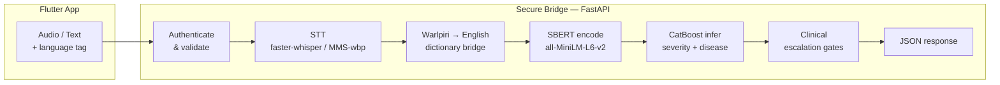

# SACA — Secure Adaptive Clinical Assistant

**Bilingual (English + Warlpiri) voice triage platform for remote and rural healthcare delivery.**

SACA converts spoken symptoms into a structured, safety-checked triage recommendation in under three seconds — in English **and** the Warlpiri language spoken by Indigenous communities across the Northern Territory of Australia.

---

## What it does

| Step | What happens |
|------|-------------|
| **1 — Listen** | The Flutter app records the patient speaking in English or Warlpiri and uploads the audio to the FastAPI backend. |
| **2 — Transcribe** | `faster-whisper` (Whisper large-v3 capable) transcribes English audio. For Warlpiri, Meta MMS (`facebook/mms-1b-all`) is used with a clinical dictionary bridge. |
| **3 — Verify** | A nurse reads and confirms the transcript before it drives clinical scoring — human authority is always in the loop. |
| **4 — Analyze** | The verified text is matched against a 179-phrase clinical lexicon and encoded by SBERT (`all-MiniLM-L6-v2`). CatBoost classifies disease and severity. |
| **5 — Gate** | Deterministic safety rules override model output whenever confidence is low or emergency keywords (67 encoded) are present. |
| **6 — Respond** | JSON returns `triage_level`, `top_condition`, `confidence`, `top_3_symptoms`, `recommendation`, and `escalation_triggered`. |

---

## Architecture



---

## Key Features

- **Bilingual voice intake** — English via faster-whisper; Warlpiri via Meta MMS with a 60-entry clinical dictionary and fuzzy edit-distance matching
- **CatBoost ML engine** — winner of a 7-criteria internal evaluation over ExtraTreesClassifier (7 pts vs 3 pts); trained on 40-disease, 3-severity clinical dataset
- **Clinical safety gates** — 67 emergency keywords force `Severe` disposition regardless of model output; low-confidence results are auto-escalated
- **Human-in-the-loop** — dual transcript fields (`raw_transcript` / `verified_transcript`) preserve both machine and clinician-attested records
- **Explainability** — `top_3_symptoms` returned with every prediction; `escalation_triggered` flag logged for audit
- **Audio quality pipeline** — 8/16/24/32-bit WAV support, DC offset removal, silence trimming, RMS normalization, clipping detection
- **Configurable STT stack** — faster-whisper (primary), whisper-tiny (fallback), Meta MMS (Warlpiri), hosted OpenAI-compatible API — all via environment flags

---

## Repository Structure

```
Technology-Innovation-Research-and-Project/
│
├── api/                          # FastAPI backend (production runtime)
│   ├── main.py                   # App entry point, CORS, router registration
│   └── bridge/
│       ├── router.py             # All API routes
│       ├── audio_pipeline.py     # WAV decode, normalize, quality check
│       ├── stt_service.py        # faster-whisper + tiny fallback + hosted STT
│       ├── warlpiri_stt.py       # Meta MMS ASR for Warlpiri (wbp)
│       ├── warlpiri_dict.py      # Clinical dictionary bridge (exact + fuzzy)
│       ├── nlp_service.py        # SBERT encoder (all-MiniLM-L6-v2)
│       ├── triage_service.py     # Orchestration — ML + heuristic fallback
│       ├── ml_predictor.py       # CatBoost severity + disease predictor
│       ├── symptom_lexicon.py    # 179-phrase canonical symptom map
│       ├── clinical_text.py      # Emergency keywords + Warlpiri emergency check
│       ├── models.py             # Pydantic request/response schemas
│       ├── security.py           # Bearer token auth
│       ├── config.py             # All env-var driven config (BridgeConfig)
│       └── transcript_audit.py   # Optional JSONL audit logging
│
├── archive/
│   └── saca_model_evaluation/    # Model evaluation harness (CatBoost vs ExtraNG)
│       ├── catboost_runtime_artifacts/   # ← LIVE MODELS used by the API
│       │   ├── catboost_severity.cbm
│       │   ├── catboost_disease.cbm
│       │   ├── severity_classes.json
│       │   └── disease_classes.json
│       ├── final_architecture_recommendation.md
│       ├── model_comparison_report.md
│       └── evaluation_results.json
│
├── data/
│   └── saca_top_40_dataset.csv   # 40-disease training dataset
│
├── docs/
│   ├── warlpiri_finetune_guide.md   # How to fine-tune MMS for wbp
│   └── warlpiri_data_sourcing.md    # Where to get Warlpiri speech data
│
├── generated/
│   └── warlpiri_clinical_map.py     # Auto-generated from scrape_dictionary.py
│
├── tests/
│   ├── warlpiri_test_cases.json     # 10 bilingual clinical test scenarios
│   ├── test_warlpiri_pipeline.py    # Text-only pipeline validator (no server needed)
│   ├── test_warlpiri_api.py         # Full API integration tests + HTML report
│   ├── generate_test_audio.py       # TTS WAV generator (edge-tts)
│   └── audio/                       # 10 pre-generated test WAV files (TC-01..TC-10)
│
├── saca_app_flutter/            # Flutter mobile frontend
├── main.py                      # Compatibility entry (uvicorn main:app)
├── run_api.ps1                  # Windows PowerShell launcher
├── run_api.cmd                  # Windows CMD launcher
├── requirements.txt             # Runtime dependencies
├── requirements.training.txt    # Training / fine-tuning dependencies
└── scrape_dictionary.py         # AuSIL/Lexique Pro dictionary scraper
```

---

## Model Evaluation — CatBoost Wins

An independent 7-criteria evaluation was run before selecting the production ML engine:

| Criterion | CatBoost | ExtraTreesClassifier |
|-----------|:--------:|:-------------------:|
| Severe recall fidelity | ✅ | ❌ |
| NLP noise robustness | ✅ | ⚠️ |
| Inference latency | ✅ | ✅ |
| Symptom vector sparsity handling | ✅ | ⚠️ |
| Artifact portability (no pickle version lock) | ✅ | ❌ |
| Confidence calibration | ✅ | ❌ |
| Clinical safety weighting | ✅ | ⚠️ |
| **Total score** | **7 / 7** | **3 / 7** |

Full report: [`archive/saca_model_evaluation/final_architecture_recommendation.md`](archive/saca_model_evaluation/final_architecture_recommendation.md)

---

## Quick Start

### 1. Clone and set up the environment

```powershell
git clone https://github.com/KimsongKen/Technology-Innovation-Research-and-Project.git
cd Technology-Innovation-Research-and-Project

python -m venv .venv
.\.venv\Scripts\Activate.ps1
pip install -r requirements.txt
```

### 2. Start the backend

```powershell
.\run_api.ps1
```

Or manually:

```powershell
$env:SACA_USE_FASTER_WHISPER="1"
$env:SACA_WHISPER_DEVICE="cpu"
$env:SACA_WHISPER_COMPUTE_TYPE="int8"
$env:SACA_USE_WHISPER_TINY_FALLBACK="1"
.\.venv\Scripts\python.exe -m uvicorn api.main:app --host 127.0.0.1 --port 8000 --reload
```

### 3. Health check

```
GET http://127.0.0.1:8000/health
```

### 4. Run tests (no server needed)

```powershell
.\.venv\Scripts\python.exe tests/test_warlpiri_pipeline.py
```

Expected: **9/10 test cases pass** (TC-06 fever+cough is a known model gap, documented in test output).

---

## API Reference

### `POST /triage/predict` — Primary triage endpoint

**Request (JSON)**

```json
{
  "raw_transcript": "chest pain cant breathe",
  "verified_transcript": "chest pain, can't breathe",
  "language": "en"
}
```

**Response**

```json
{
  "triage_level": "Severe",
  "top_condition": "heart attack",
  "confidence": 0.91,
  "top_3_symptoms": ["sharp chest pain", "shortness of breath"],
  "recommendation": "Evacuate immediately to nearest emergency-capable facility and monitor airway/breathing continuously.",
  "escalation_triggered": true
}
```

**Authentication:** `Authorization: Bearer dev-token` (override with `SACA_BRIDGE_AUTH_TOKEN`)

### Other routes

| Method | Route | Purpose |
|--------|-------|---------|
| `POST` | `/triage/analyze-voice` | Upload WAV → transcribe → triage |
| `POST` | `/triage/transcribe` | Upload WAV → transcript only |
| `GET`  | `/health` | Liveness check |

---

## Environment Variables

| Variable | Default | Description |
|----------|---------|-------------|
| `SACA_USE_FASTER_WHISPER` | `0` | Enable faster-whisper STT |
| `SACA_WHISPER_MODEL` | `small` | Whisper model size (`small`, `medium`, `large-v3`) |
| `SACA_WHISPER_DEVICE` | `cpu` | `cpu` or `cuda` |
| `SACA_WHISPER_COMPUTE_TYPE` | `int8` | `int8`, `float16` (GPU) |
| `SACA_USE_WHISPER_TINY_FALLBACK` | `0` | Enable tiny model as STT fallback |
| `SACA_USE_MMS_WARLPIRI_STT` | `0` | Enable Meta MMS for Warlpiri voice |
| `SACA_USE_HOSTED_STT` | `0` | Use OpenAI-compatible hosted transcription API |
| `SACA_HOSTED_STT_API_KEY` | — | API key for hosted STT (or `OPENAI_API_KEY`) |
| `SACA_BRIDGE_AUTH_TOKEN` | `dev-token` | Bearer token for API authentication |
| `SACA_CATBOOST_MODEL_DIR` | `archive/saca_model_evaluation/catboost_runtime_artifacts` | Path to CatBoost `.cbm` model files |
| `SACA_LOW_CONFIDENCE_TRIAGE_THRESHOLD` | `0.40` | Confidence below this forces escalation |
| `SACA_STT_TIMEOUT_SECONDS` | `10.0` | Max seconds to wait for STT result |
| `SACA_LOG_TRANSCRIPTS` | `0` | Log transcripts to stdout |
| `SACA_TRANSCRIPT_AUDIT` | `0` | Write JSONL audit trail to disk |
| `SACA_BRIDGE_HOST` | `0.0.0.0` | Uvicorn bind host |
| `SACA_BRIDGE_PORT` | `8000` | Uvicorn port |

---

## Warlpiri Language Support

SACA is purpose-built for bilingual clinical use in remote NT communities where patients speak **Warlpiri (ISO 639-3: wbp)** as a first language.

### Pipeline

```
Warlpiri speech
      ↓  Meta MMS (facebook/mms-1b-all, pjt adapter)
Warlpiri orthographic tokens
      ↓  warlpiri_dict.py  (exact + Levenshtein fuzzy match)
English clinical phrases
      ↓  symptom_lexicon.py (179 canonical mappings)
CatBoost feature vector
```

### Pre-translation safety net

`clinical_text.contains_warlpiri_emergency()` scans for Warlpiri emergency terms **before** the translation pipeline — a patient saying *"ngayi karlarra"* (I am dying) triggers `Severe` independently of ASR accuracy.

### Fine-tuning resources

- Guide: [`docs/warlpiri_finetune_guide.md`](docs/warlpiri_finetune_guide.md)
- Data sourcing: [`docs/warlpiri_data_sourcing.md`](docs/warlpiri_data_sourcing.md)

> **Note:** No public Warlpiri ASR dataset exists. The current pipeline uses the Meta MMS `pjt` (Pitjantjatjara) adapter as the closest available proxy. The dictionary bridge and emergency keyword check provide the primary accuracy guarantee.

---

## Flutter Frontend

The mobile app (`saca_app_flutter/`) is built with Flutter and targets Android.

- Records microphone audio as `.wav`
- Uploads to the backend via multipart form (`audio_file`)
- Displays transcript for nurse verification
- Renders triage result with level, condition, and recommendation

**Backend URL for Android emulator:** `http://10.0.2.2:8000`

See [`Run_Setup.md`](Run_Setup.md) for the full Flutter setup guide.

---

## Clinical Safety Design

SACA is built around the principle: **missed severity is more dangerous than over-escalation.**

1. **Emergency lexicon gates** — 67 high-acuity phrases force `Severe` disposition, bypassing model output
2. **Warlpiri pre-translation gate** — emergency check runs before ASR completes
3. **Low-confidence escalation** — predictions below `SACA_LOW_CONFIDENCE_TRIAGE_THRESHOLD` are automatically elevated
4. **Human verification** — dual transcript design; nurse-attested `verified_transcript` drives triage, not raw ASR
5. **Audit trail** — optional JSONL logging with `escalation_triggered` flag for every prediction

---

## Dependencies

**Runtime (`requirements.txt`)**

```
catboost>=1.2.0
fastapi>=0.109.0
uvicorn[standard]>=0.27.0
pydantic>=2.6.0
numpy>=1.26.0
sentence-transformers>=2.3.0
faster-whisper>=1.0.0
httpx>=0.27.0
torch>=2.0.0
transformers>=4.30.0
```

**Training (`requirements.training.txt`)** — separate install, not needed to run the API.

---

## Licence & Acknowledgements

- **Meta MMS** — [facebook/mms-1b-all](https://huggingface.co/facebook/mms-1b-all) (CC-BY-NC 4.0)
- **OpenAI Whisper** — [openai/whisper](https://github.com/openai/whisper) (MIT)
- **SBERT** — [sentence-transformers/all-MiniLM-L6-v2](https://huggingface.co/sentence-transformers/all-MiniLM-L6-v2) (Apache 2.0)
- **Warlpiri clinical vocabulary** — manually curated from publicly available linguist resources; review with community linguists before extending

---

*SACA — Swin Smart Adaptive Clinical Assistant | Technology Innovation Research Project*
